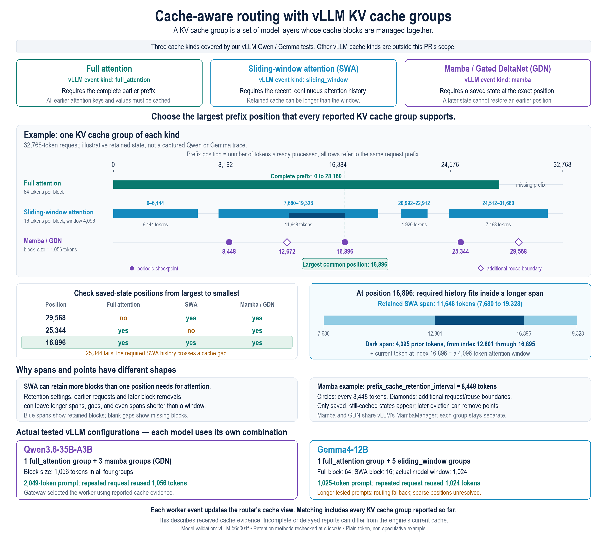

# Group-aware vLLM KV events

Cache-aware routing applies the events received from each worker and discovers cache groups as they appear. It finds a common reported token boundary: full attention needs a continuous prefix, sliding-window attention needs the retained tail, and Mamba/GDN needs a state checkpoint at that boundary. Independent group maxima cannot simply be minimized because checkpoints may be sparse. A group that has never been reported does not participate.

The bridge automatically selects this path when the installed vLLM event schema supplies group metadata. There is no additional environment variable, manual group list or request restriction. Existing KV-event publisher and gateway cache-aware routing configuration still apply. Older vLLM event schemas keep the legacy converter. Updated protocol bindings, bridge and gateway are needed for group-aware scores; older gateways ignore the additive group fields and receive no legacy cache evidence from these batches.

## Received-event contract

Native hashes remain opaque byte identities, including unsigned 64-bit exports. Dense stores with a known parent connect token prefixes to those identities. Sparse stores preserve their entire token span and membership; the consumer never assigns omitted hashes ordinal token offsets. Another group's dense report can resolve their shared hash identities. An unresolved report waits for its parent while live evidence depends on it; an unknown parent is never treated as a root. Token prefixes match their received content without reproducing the engine's hash algorithm or requiring its seed.

STORE supplies idempotent positive evidence; REMOVE withdraws that evidence in the named group. Neither operation proves a physical-copy count. CLEAR empties reported memberships while retaining the groups already observed. Known gaps, disconnects and malformed input discard the observation session; subsequent valid reports immediately begin a new view. No complete group roster or empty-cache baseline is required. At the end of each event batch, unused pending reports are discarded and prefix history is released to Radix's existing whole-chain collector. Live descendants keep their ancestry; dead tails within live chains may remain. There is no additional aggregate capacity limit or capacity-triggered reset, and this is not a total memory bound. If all supporting history has been collected, a later child cannot be matched until a usable parent is reported again. This can lose affinity, including for a Mamba checkpoint whose parent was removed in an earlier batch, without inventing a shorter rooted prefix.

The recognized event kinds are `full_attention`, `mla_attention`, `sliding_window` and `mamba`. MLA uses the full-attention coverage condition; Mamba includes GDN models using vLLM's Mamba cache manager. This is a contract about advertised event semantics, not a claim that every concrete native cache-spec subclass or scheduler has identical lookup rules. Native global alignment, partial-hit eligibility and full spec equality are not present in these events and are not reconstructed. Unsupported kinds or insufficient metadata produce no cache-affinity score and use existing routing fallback. CPU, remote and owned-offload records are filtered; rank values other than zero are unsupported. LoRA and extra hash inputs cannot establish plain-token mappings; namespaced requests use load fallback. Inference requests themselves remain unchanged.

## Producer and transport limits

The result is a common boundary supported by resolved received reports. It is not a cache reservation or the engine's exact current reusable-token count. Unresolved histories can hide additional matches; unreported groups and stale/missing removals can make the reported view more optimistic than current engine state. These are separate from correctly applying the events that did arrive.

Audited vLLM revision: [`56d001faf0f53c72fcedbbdd77e5418f68fe7494`](https://github.com/vllm-project/vllm/tree/56d001faf0f53c72fcedbbdd77e5418f68fe7494). Its publisher is asynchronous and offers optional finite replay. The current SMG vLLM subscriber uses live rank-zero ZMQ events and does not fetch that replay. A silent publisher restart without a stream disconnect has no epoch identifier; a missing final event may be undetectable until later traffic. This change does not claim to repair those transport limitations.

The native `full` reporting helper can re-report existing blocks and can include hashes for missing sparse-prefix blocks. Consequently a reported-state score may disagree with native lookup even with caught-up transport. See the pinned [event schema](https://github.com/vllm-project/vllm/blob/56d001faf0f53c72fcedbbdd77e5418f68fe7494/vllm/distributed/kv_events.py), [block lifecycle](https://github.com/vllm-project/vllm/blob/56d001faf0f53c72fcedbbdd77e5418f68fe7494/vllm/v1/core/block_pool.py) and [native lookup](https://github.com/vllm-project/vllm/blob/56d001faf0f53c72fcedbbdd77e5418f68fe7494/vllm/v1/core/single_type_kv_cache_manager.py).

## Validation

Tests replay 159 snapshots and 11 lifecycle transitions, distinguishing received-event assertions from the 63 snapshots with comparable native expectations. Python conversion tests and frozen protobuf replay cover the bridge/consumer boundary, including a two-worker selection change after a Mamba checkpoint removal. Legacy converter and routing tests remain relevant compatibility checks. Use freshly generated protocol bindings when running the Python suite, `cargo test -p kv-index`, and the `smg` library tests. Fixture conformance alone does not establish GPU behavior or performance.
